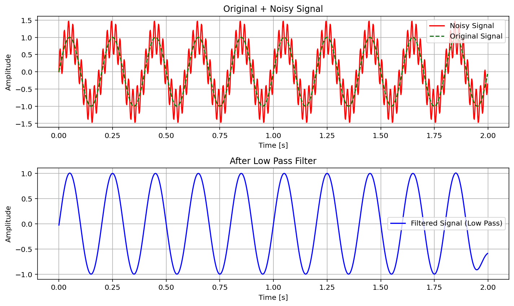

# Low Pass Filter Simulation in Python

This project demonstrates a "digital Low Pass Filter (LPF)" using Python, NumPy, SciPy, and Matplotlib.  
It shows how high-frequency noise can be removed from a signal, leaving only the smooth low-frequency content.

## Project Structure
  

low-pass-filter-simulation/
├─ src/
│ └─ low_pass_filter.py
├─ images/
│ └─ result_plot.png
├─ docs/
│ └─ report.pdf
└─ README.md

## Steps
1. Generate a noisy sine wave (5Hz + 50Hz noise).
2. Design a Butterworth low-pass filter with 10Hz cutoff.
3. Apply the filter and plot results.

## Tools
- Python (Spyder / Anaconda)
- NumPy
- SciPy
- Matplotlib

---

##  Objective
To simulate and analyze the behavior of a **Low Pass Filter** applied to a noisy sine wave.

---

##  Description
A composite signal is created by combining:
- A low-frequency sine wave (5 Hz)
- A high-frequency noise (50 Hz)

A "4th-order Butterworth Low Pass Filter" with a cutoff frequency of **10 Hz** is then applied using SciPy’s `butter()` and `filtfilt()` functions.

---

## 📊 Results
The filter successfully removes high-frequency components from the noisy signal.  
Below is an example of the filtered output:

---

## 🧾 Report
A detailed report of this project is available in  
[`docs/Low_Pass_Filter_Report.pdf`](docs/Low_Pass_Filter_Report.pdf)

---

## 👩‍💻 Author
**Bochra Oudha**  
Master’s Student in Embedded Systems  
October 2025

---

## 📜 License
This project is released under the **MIT License**.

